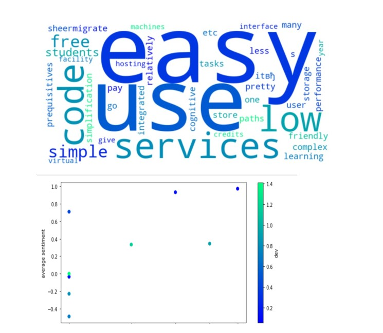

# Sentiment Analysis on Verbatim User Feedback on Microsoft Azure using Azure AI Text Analytics Cognitive Service

In this workshop, we will discuss *the use of Microsoft Azure for Text Analytics to analyze the sentiments of Azure users*.

| **Project Goal**              | *Learn how to use AI Text Analytics to extract meaningful insights from text*                                    |
| ----------------------------- | --------------------------------------------------------------------- |
| **What will you learn**       | *How to use Azure Text Analytics Cognitive Service, How to analyze and visualize data with Python*                                        |
| **What you'll need**          | *[Azure Subscription](https://azure-for-academics.github.io/getting-azure), ability to run [Jupyter Notebook](https://soshnikov.com/education/how-to-execute-notebooks-from-github/)* |
| **Duration**                  | *1hr-1.5 hours*                                                                |
| **Just want to try the app or see the solution?** | *a link to the completed project sample app or solution folder*                          |
| **Slides** | [Powerpoint](slides.pptx)                          |

## Pre-Learning

*Check out [Cognitive Services for Language](https://docs.microsoft.com/en-us/learn/paths/explore-natural-language-processing/)*

## Prerequisites

*For this workshop:*  <br> 
1. You need to have an Azure Account. You can get either the [Azure for Students](https://azure.microsoft.com/en-us/free/students/?WT.mc_id=academic-49822-dmitryso) version or use the [Azure Free Trial](https://azure.microsoft.com/en-us/free/?WT.mc_id=academic-49822-dmitryso) version <br>
2. You need to have working knowledge of [Jupyter Notebooks](https://jupyter.org/) on your local machine. Alternatively, you can locally install [Python](https://www.python.org/downloads/) and use it on [VS Code](https://code.visualstudio.com/download) or on [Github Codespaces](https://github.com/features/codespaces)<br>


## What students will learn

In this workshop, students would learn to use Azure's Text Analytics service for performing a sentiment analysis on user data.




## Milestone 1: Getting and Understanding the Data
The data has been manually aggregated by collecting feedback from Azure users. Check out the [Data](https://github.com/ssanya942/Sentiment-Analysis-Using-Azure-Text-Analytics/tree/main/workshop/Data) folder to access feedback data segregated into 5 files: <br>
1. [AzComparison.txt](https://github.com/ssanya942/Sentiment-Analysis-Using-Azure-Text-Analytics/blob/main/workshop/Data/AzComparison.txt) contains a comparitive analysis of Azure with other cloud providers from the users' perspective. <br>
2. [AzEduhub.txt](https://github.com/ssanya942/Sentiment-Analysis-Using-Azure-Text-Analytics/blob/main/workshop/Data/AzEduhub.txt) contains the users' overall insights regarding Azure <br>
3. [AzNegative.txt](https://github.com/ssanya942/Sentiment-Analysis-Using-Azure-Text-Analytics/blob/main/workshop/Data/AzNegative.txt) contains the complaints users have against Azure <br>
4. [Azpositive.txt](https://github.com/ssanya942/Sentiment-Analysis-Using-Azure-Text-Analytics/blob/main/workshop/Data/Azpositive.txt) contains positive user reviews on Azure
5. [AzPMAdvice.txt](https://github.com/ssanya942/Sentiment-Analysis-Using-Azure-Text-Analytics/blob/main/workshop/Data/AzPMAdvice.txt) contains users' advice for Azure's Program Managers


> *If you are an Azure user, you could amplify our database of user feedback by filling up this [feedback form.](https://forms.office.com/r/M5EuyHbTB3) The required modifications would be made in the data in this repository itself.*

## Milestone 2: Running the Notebook and Exploring the Data
After you get the data, you need to open .......ipynb or Detailed.ipynb notebook and start writing code there, following the instructions inside the notebook.

Note: There are two versions of the notebooks provided, and you can chose the one most suitable to you:
There is also a notebook with the solution, which you can consult should you experience a problem you are not able to solve. However, we suggest you to try and solve all the problems yourself, using stack overflow as a reference to find solutions.


## Milestone 3: Creating and Using the Text Analytics Endpoint
We shall now be using the Text Analytics Service to analyze the data collected. At this point, you must have your Azure Subscription ready.

Log into your [Azure Portal](https://portal.azure.com/#home) and create a new [Cognitive Resource for Language](https://docs.microsoft.com/azure/cognitive-services/language-service/overview/?WT.mc_id=academic-49822-dmitryso). Start creating the resource [here](https://ms.portal.azure.com/#create/Microsoft.CognitiveServicesTextAnalytics)

After the creation of the resource, navigate to the *Keys and Endpoints* option under the *Resource Management* pane and note either of the keys and the endpoint. Once you have created the resource, you should go to the portal and copy Endpoint URL and Access key into the notebook.


In order to call this service, the key and endpoint must be noted and copied.

```python
from azure.core.credentials import AzureKeyCredential
from azure.ai.textanalytics import TextAnalyticsClient, AnalyzeSentimentAction, ExtractKeyPhrasesAction

credential = AzureKeyCredential("paste_your_key_here")
cli = TextAnalyticsClient(endpoint="https://analyze-user-sentiments.cognitiveservices.azure.com/", credential=credential)
```
Test the use of this service by performing a simple sentiment analysis. 
```python
def analyze(doc):
    pol = cli.begin_analyze_actions(doc,actions=[AnalyzeSentimentAction(), ExtractKeyPhrasesAction() ])
    res = pol.result()
    return [
        { 
        "doc" : d,
        "sent" : sent.sentiment if not sent.is_error else None,
        "pos_score" : sent.confidence_scores.positive if not sent.is_error else None,
        "neg_score" : sent.confidence_scores.negative if not sent.is_error else None,
        "neu_score" : sent.confidence_scores.neutral if not sent.is_error else None,
        "key" : keyw.key_phrases if not keyw.is_error else []
        }
      for d,(sent,keyw) in zip(doc,res)]

analyze(["I was so glad to be a part of this festival"]) 

```
This code snippet is used to accept the text "*I was so glad to be a part of this festival*" and analyze the sentiment trying to be conveyed by the user. It returns the input string, the sending success message, the positive score,the negative score, the neutral score and the key. 
The output for the aforementioned code snippet depicts a positive score of 1.0 and a negative and a neutral score of 0.0 respectively. This indicates that the general sentiment expressed by the user was positive.

```
[{'doc': 'I was so glad to be a part of this festival',
  'sent': 'positive',
  'pos_score': 1.0,
  'neg_score': 0.0,
  'neu_score': 0.0,
  'key': ['part', 'festival']}]
```


## Process the Data
Now, the data collected must be finally processed to derive sentimental insights from them. 
Analyzing the first 10 records:

```python
def analyzex(l):
    res = []
    for i in range(0,len(l),10):
        res.extend(analyze(l[i:i+10]))
    return res

dt = {}
for k,v in data.items():
    print(f"Processing {k}")
    dt[k] = analyzex(v)
```
Once all the data files have been processed, the analysis is pickled, so that it can be retrieved at a later date. 

```python
import pickle
with open('data.pkl','wb') as f:
    pickle.dump(dt,f)

```
Text Analytics Service can now perform sentiment analysis on the user feedback to express the general sentiment the Azure user intends to convey.
One example of sentriment analysis is attached below.
```
{'Azpositive.txt': [{'doc': 'the sheer performance and the simplification of complex tasks with less prequisitives.',
   'sent': 'neutral',
   'pos_score': 0.05,
   'neg_score': 0.13,
   'neu_score': 0.82,
   'key': ['sheer performance',
    'complex tasks',
    'less prequisitives',
    'simplification']},
 ```


## Milestone 5

```javascript
//code snippets to aid in the building process
```

> *tips, tricks, callouts*

## Quiz or Code Challenge

*Add an activity to demonstrate that students have comprehension of the material*

## Next steps

*links to Microsoft Learn to further learning progress, and/or a path to certifications*

## Optional Transfer knowledge activity

*suggest, or add as an addendum, a way to extend students knowledge of the topic by creating a new app or demo that builds on the original workshop materials.*

## Feedback

Be sure to give [feedback about this workshop](https://forms.office.com/r/MdhJWMZthR)!

[Code of Conduct](CODE_OF_CONDUCT.md)

